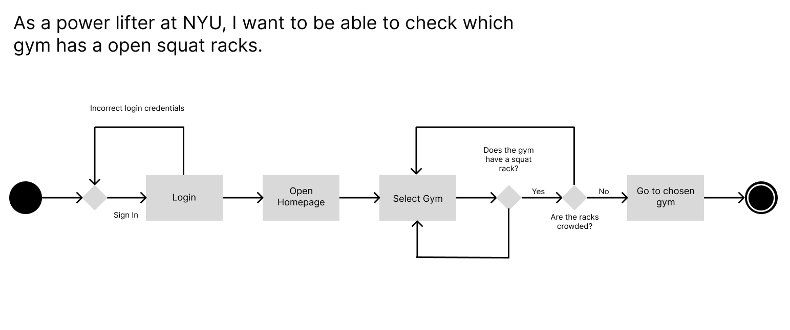
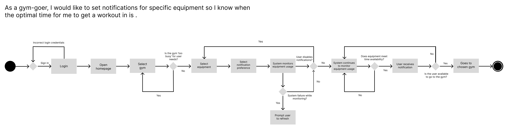

# Specification Phase Exercise

A little exercise to get started with the specification phase of the software development lifecycle. See the [instructions](instructions.md) for more detail.

## Team members

- Andy Cabindol: https://github.com/andycabindol
- Preston Lee: https://github.com/prestonglee0805
- Aaqila Patel: https://github.com/aaqilap
- Edwin Chen: https://github.com/Eracks1012

## Stakeholders 

Stakeholder Interview #1

    Profile:

        Age: 20
        School: College of Arts and Science (CAS)
        Major: Biology

    Responses:

        Q: How often do you work out?
        A: 5 days a week.

        Q: What time and days do you typically work out? Why?
        A: Mornings before starting the day; it makes me feel productive for the rest of the day.

        Q: What types of workouts do you do?
        A: Strength training and cardio (stairmaster and treadmill).

        Q: What are your specific fitness goals?
        A: To maintain my physical and mental health.

        Q: Do you have a preferred NYU gym? Why?
        A: 404 Fitness, because it has multiple floors and a variety of equipment to utilize, even on busy days.

        Q: How long do your workouts take?
        A: About 1 to 1.5 hours on average.

        Q: Do you go to any non-NYU gyms? If so, why?
        A: Esporta Fitness when I’m home on break; it offers good machine options that work all muscle groups.

Stakeholder Interview #2

    Profile:

        Age: 21
        School: Tandon School of Engineering
        Major: Chemical and Biomolecular Engineering
    
    Responses:

        Q: How often do you work out? 
        A: 5–6 times a week.

        Q: What time and days do you typically work out? Why?
        A: Mornings, usually skipping Wednesdays or Thursdays. I have the most energy in the morning and spend evenings doing homework.

        Q: What types of workouts do you do?
        A: Running and strength training with weights.

        Q: What are your specific fitness goals?
        A: No specific goals, but I want to feel good. (I do want to run a marathon, though.)

        Q: Do you have a preferred NYU gym? Why?
        A: 404 Fitness, because it’s the closest to me.

        Q: How long do your workouts take?
        A: 45–60 minutes, unless I include a longer run.

        Q: Do you go to any non-NYU gyms? If so, why?
        A: Occasionally, I attend SoulCycle classes.

## Product Vision Statement 

The NYU Gym Traffic Tracker is a user-friendly app that provides real-time gym occupancy data across NYU’s fitness facilities, allowing students and staff to plan their workouts efficiently, minimize wait times, and enhance their fitness experience.

## User Requirements 

    1. As an NYU student, I want to see the current occupancy levels of all NYU gyms so that I can choose the least crowded one

    2. As a gym-goer, I want to see a list of all gym equipment and the percentage of each being used so that I can decide whether my preferred equipment is available. 

    3. As a busy student, I want the app to recommend the best time to visit each gym so that I can plan my workout efficiently around my schedule.

    4. As an NYU resident, I want the app to calculate the distance from my current location to each gym so that I can decide which gym is the closest.

    5. As a new student on campus, I want to see each gym's hours, location, and contact information so that I can familiarize myself with all the facilities.

    6. As a student dorming very close to the gym, I want to receive notifications when a gym’s occupancy drops below a certain threshold so that I can quickly go or adjust my schedule. 

    7. As a beginner at the gym, I want to know the quieter times at each facility so that I can feel more comfortable and confident while learning to use the equipments.

    8. As a powerlifter at NYU, I want to know the availability of squat racks and platforms so that I can schedule my training sessions without long delays.

    9. As a runner, I want to know if there are any treadmills available so I don't have to wait. 

    10. As a commuter, I want to be able to see if each of the gyms are open.

## Activity Diagrams

Activity Diagram for User Story 1: \
As an NYU student, I want to see the current occupancy levels of all NYU gyms so that I can choose the least crowded one\

Activity Diagram for User Story 2: \
As a powerlifter at NYU, I want to know the availability of squat racks and platforms so that I can schedule my training sessions without long delays.\

## Clickable Prototype

https://www.figma.com/proto/G3dVGWP1LRRPfibWZJE9xy/preston-enjoyers?node-id=71-268&t=RpABlqfmCwVkhQAj-1
